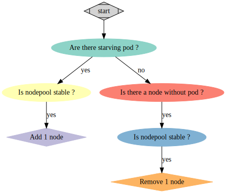

# Batch Processing with OVHcloud Managed Kubernetes

The main goal of this demo is to show how to use OVHcloud Managed Kubernetes to do batch processing or grid computing with a minimal setup.

The tools used will be:
- OVHcloud Managed Kubernetes with nodepool
- OVHcloud Object Storage

For the demo, we'll use a custom docker image based on ffmpeg to generate webm video thumbnails.

## Node autoscaling

To do batch processing on our cluster, we'll configure 2 nodepools:
- a `system` nodepool for our admin and monitoring Pods
- a `compute` nodepool for our computing nodes

Both nodepools can be initialized with this configuration:

```yaml
apiVersion: kube.cloud.ovh.com/v1alpha1
kind: NodePool
metadata:
  name: system
spec:
  desiredNodes: 1
  flavor: b2-7
  maxNodes: 3
  minNodes: 1
---
apiVersion: kube.cloud.ovh.com/v1alpha1
kind: NodePool
metadata:
  name: compute
spec:
  desiredNodes: 0
  flavor: c2-15
  maxNodes: 100
  minNodes: 0
```

### Autoscaling monitoring

We'll deploy a nodepool monitoring deployment which has the following state machine




## Useful info

- for the client calls https://docs.rs/k8s-openapi/0.9.0/k8s_openapi/api/core/v1/
- for the api calls, use the `-v=[6-8]` on `kubectl`
- for the api calls, use `kubectl get --raw '/apis/<kind>/<version>/<entity>' |jq .`
